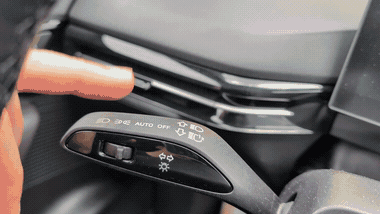
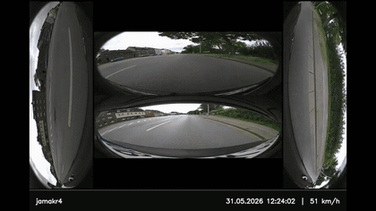

**Tesla-style turn signal camera overlay and native 4-camera dashcam for the MG4 EV.**

Community mod for the MG4 EV (AAOS 9, pre-2026 facelift) that replaces the stock launcher overlay with a cleaner tile view, removes the auto-close speed threshold, and adds a proper native-camera dashcam mode.

 

  
  
  
  
  
  

  
  
  
  
  

  <a href="https://github.com/jamakr4/MG4-360-Camera-App/wiki"><strong>Wiki</strong></a>
  &nbsp;·&nbsp;
  <a href="https://github.com/users/jamakr4/projects/4"><strong>Project Board</strong></a>
  &nbsp;·&nbsp;
  <a href="https://github.com/jamakr4/MG4-Dashcam-Trigger"><strong>Dashcam Companion App</strong></a>
  &nbsp;·&nbsp;
  <a href="https://github.com/jamakr4/MG4-Digital-Rearview-Trigger"><strong>Digital Mirror Companion App</strong></a>
  &nbsp;·&nbsp;
  <a href="https://youtu.be/Rzb_Owc_RT0"><strong>Demo Video</strong></a>

> [!IMPORTANT]
> **Work in progress.** Check the [Wiki](https://github.com/jamakr4/MG4-360-Camera-App/wiki) for technical details and the [Project Board](https://github.com/users/jamakr4/projects/4) for current progress.

  

## Feature Highlights

- **Turn signal overlay**: opens automatically when the indicator is activated, without the original speed-based auto-close behavior.
- **Digital rearview mirror**: keeps the factory rear camera visible as a persistent floating mirror for situations where the rear window is blocked by cargo, while still yielding to turn-signal cameras and then restoring the rear view afterwards.
- **Tesla-style tile view**: replaces the launcher-like OEM overlay, also known as the fullscreen takeover, with a cleaner presentation.
- **Native 4-camera dashcam**: records all four factory cameras into a single 720x240 grid clip with a footer including time, speed, and a custom signature.
- **Event capture**: saves a pre/post recording window into a separate `events/` folder
- **Flexible overlay feedback**: pause, resume, event, and error banners with adjustable size and volume.
- **OEM 360 AVM coexistence**: can briefly yield camera access so the stock reverse/360 view still opens when needed.
- **External trigger support**: send `com.drivehub.kamera.action.TRIGGER_DASHCAM_EVENT` from ADB or another app to save an event clip.
- **Auto language selection**: English and German are selected automatically from the vehicle language.

## Preview

  

  
  

  <a href="https://youtu.be/Rzb_Owc_RT0">▶ Full demo on YouTube</a>

## Quick Guides

<strong>Indicator Cam</strong>

The indicator camera opens automatically when you activate the left or right turn signal.

To use it:

1. Open `Settings` -> `Signal Camera`.
2. Enable `Overlay on signal`.
3. Optional: enable `Lane changes only` to show the signal camera only at or above the selected speed (15 km/h by default).
4. Optional: enable `Rotate side cameras to driving direction` if you prefer the side cameras to match the direction of travel.
5. Optional: tune `Overlay hide delay` and `Minimum on-time` so the camera does not disappear too abruptly.
6. `Tap to hide` is enabled by default (2 seconds) – one tap dismisses the overlay temporarily, it reappears afterwards if the signal is still active.

Important:

- Disable the OEM SAIC indicator camera popup first, otherwise both systems may compete.
- While the main app is open, the app can route the signal camera into the main preview instead of showing the floating overlay.

  
  &nbsp;
  

<strong>Dashcam</strong>

The dashcam records all four factory cameras into one combined clip and can also save dedicated event recordings.

To use it:

1. Open `Settings` -> `Dashcam`.
2. Enable `Dashcam`.
3. Optional: adjust FPS, footer signature, and whether speed should be shown in the recording.
4. Optional: in `Settings`, enable the global OEM 360° AVM setting if you still want to use the stock reverse/360 camera app alongside the custom features (recommended).
5. Use `Trigger event save` in the app, the hazard-light trigger, or an external broadcast to save an event clip.

Notes:

- One normal rolling clip is 30 seconds long.
- Event saves keep a separate pre/post buffer in the `events/` folder.
- The companion app can trigger an event save externally via `com.drivehub.kamera.action.TRIGGER_DASHCAM_EVENT`.
- If the dashcam is currently off and you still trigger an event, the app can switch into future-only recording so at least the post-trigger window is captured.

**On-demand recording without loop mode**

You do not need to run the dashcam in continuous loop mode to capture video. Two lighter alternatives are available:

- **Test clip** — a button on the home screen starts a single recording for a configurable duration (default 30 s, adjustable in Settings up to 120 s). Useful for quickly capturing something without enabling the full ring buffer. Test clips are saved to a separate `test/` subfolder and do not participate in the ring-buffer cleanup cycle.
- **Future-only event recording** — if continuous recording is off but you still trigger an event save (via the home screen button or the companion app broadcast `com.drivehub.kamera.action.TRIGGER_DASHCAM_EVENT`), the app automatically starts a short recording from that moment forward and saves it as an event. The pre-trigger window is lost since no loop was running, but at least the next few clips are captured.

> [!CAUTION]
> Continuous loop recording writes constantly to internal storage. This can accelerate flash wear over time. Use at your own risk. Test clips and event-only recording are not affected since they only record on demand.

<strong>Digital Rearview</strong>

Digital Rearview is the persistent rear camera overlay.

To use it:

1. Open `Settings` -> `Digital Rearview`.
2. Enable `Digital rearview`.
3. The rear camera will stay visible as a floating window when no higher-priority signal overlay is active.
4. You can drag and resize the overlay, and the app restores the last layout automatically.
5. `Tap to temporarily hide` is enabled by default (5 seconds) – one tap dismisses it and it reappears after the set duration.
6. The "X" in the preview will close it permanently until turned back on.

Behavior:

- Reverse gear still has priority and follows the OEM/main-screen flow.
- Turn-signal cameras temporarily override Digital Rearview and the rearview returns afterwards.
- The digital rearview can also be toggled by the separate companion trigger app.

## Build Setup

OpenCV is referenced from a local path, so Android builds can fail if `OpenCV_DIR` is not set correctly.

Before building:

1. Download the Android SDK package from [opencv/opencv releases](https://github.com/opencv/opencv/releases).
2. Use `opencv-android-sdk.zip`, not the Windows or macOS packages.
3. Update `OpenCV_DIR` in [`app/src/main/cpp/CMakeLists.txt`](app/src/main/cpp/CMakeLists.txt) so it matches your local OpenCV Android SDK path.

The notification sound is licensed under CC-BY-NC-4.0 and is therefore not tracked in this repository.

1. Download the source from [Freesound: notification-sound-7062 by HenryCena82595](https://freesound.org/s/731783/).
2. Convert it to `.ogg` (Vorbis) if Freesound serves another format.
3. Place it at `app/src/main/res/raw/notification_sound_7062_henrycena82595.ogg`.

## Dev Mode

A hidden Dev tab exposes lower-level tuning knobs. To unlock it, open Settings and tap the version label at the bottom **5 times**.

What you can tweak:

- **Polling rates** for idle, turn-signal-active, and Android Auto / CarPlay foreground scenarios.
- **Overlay safe area** so the tile overlay cannot be dragged into the top system region.
- **Dashcam retention** for rolling clips and saved event counts.
- **Storage override** to record somewhere other than `Downloads/dashcam/`.
- **Reset defaults** to go back to the built-in baseline.

> [!CAUTION]
> Dev Mode is intentionally powerful and only lightly guarded.
>
> Values are not validated against your storage size, system load, camera bandwidth, or signal timing realities. Aggressive polling can hurt responsiveness, large buffers can eat storage quickly, and bad combinations may produce behavior nobody has tested yet.
>
> If something gets weird after tuning, use **Reset defaults** first. If that does not help, clear the app data.

## Insights

<a href="https://www.star-history.com/#jamakr4/MG4-360-Camera-App&Date">
  <picture>
    <source media="(prefers-color-scheme: dark)" srcset="https://api.star-history.com/svg?repos=jamakr4/MG4-360-Camera-App&type=Date&theme=dark">
    <source media="(prefers-color-scheme: light)" srcset="https://api.star-history.com/svg?repos=jamakr4/MG4-360-Camera-App&type=Date">
    
  </picture>
</a>

**Support the project** — the most helpful things you can do:

- Star the repository on GitHub.
- Share feedback, ideas, and bug reports through Issues or discussions.
- Tell other MG4 tinkerers about it.

Financial support sounds nice in theory, but German tax overhead makes donation platforms impractical for this hobby project right now. 

 

## Safety and Disclaimer

> [!WARNING]
> Use at your own risk.
>
> This project modifies behavior around production-vehicle system apps. The author(s) take no responsibility for damage, malfunction, data loss, voided warranty, or any other consequences. Test carefully and only in safe conditions.

This is an independent community project and is **not affiliated with SAIC, MG Motor, or any of their subsidiaries**.

## Credits

- Analysis based on community research from [XDA Forums: MG4 Electric AAOS 9](https://xdaforums.com/t/mg4-electric-aaos-9-playing-and-possibly-other-mg-models.4697712/)
- Tile view inspiration from [merth4n](https://xdaforums.com/m/merth4n.13350648/)
- OpenCV 4.9.0 - Apache License 2.0
- AndroidX AppCompat 1.7.1 - Apache License 2.0
- AndroidX Activity 1.12.4 - Apache License 2.0
- AndroidX ConstraintLayout 2.2.1 - Apache License 2.0
- Material Components for Android 1.13.0 - Apache License 2.0
- Icons based on [Google Material Symbols](https://developers.google.com/fonts/docs/material_symbols) - Apache License 2.0
- `notification-sound-7062` by `HenryCena82595` - [Freesound](https://freesound.org/s/731783/) - Attribution NonCommercial 4.0

## License

GPL-3.0 - see [LICENSE](LICENSE) for details.
