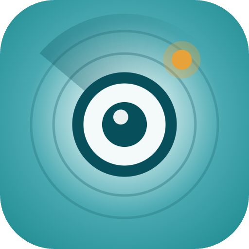

# MG4-Camera-Mod

<table>
  <tr>
    <td width="160" valign="middle">
      
    </td>
    <td valign="middle">
      <strong>Tesla-style turn signal camera overlay and native 4-camera dashcam for the MG4 EV.</strong>
      
Community mod for the MG4 EV (AAOS 9, pre-2026 facelift) that replaces the stock launcher overlay with a cleaner tile view, removes the auto-close speed threshold, and adds a proper native-camera dashcam mode.

    </td>
  </tr>
</table>

  
  
  
  

  <a href="https://github.com/jamakr4/MG4-360-Camera-App/wiki">Wiki</a> |
  <a href="https://github.com/users/jamakr4/projects/4">Project Board</a> |
  <a href="https://github.com/jamakr4/MG4-Dashcam-Trigger">Companion Trigger App</a> |
  <a href="https://youtu.be/Rzb_Owc_RT0">Dashcam Demo Video</a>

> [!IMPORTANT]
> This is a work in progress for the MG4 EV platform. Test carefully and expect rough edges while features and OEM interoperability keep evolving.

## Feature Highlights

- **Turn signal overlay**: opens automatically when the indicator is activated, without the original speed-based auto-close behavior.
- **Tesla-style tile view**: replaces the launcher-like OEM overlay with a cleaner multi-camera presentation.
- **Native 4-camera dashcam**: records all four factory cameras into a single `720x240` grid clip.
- **Event capture**: saves a pre/post recording window into a separate `events/` folder with a configurable retention cap.
- **Flexible overlay feedback**: pause, resume, event, and error banners with adjustable size and volume.
- **OEM 360 AVM coexistence**: can briefly yield camera access so the stock reverse/360 view still opens when needed.
- **External trigger support**: send `com.drivehub.kamera.action.TRIGGER_DASHCAM_EVENT` from ADB or another app to save an event clip.
- **Auto language selection**: English and German are selected automatically from the vehicle language.

## Preview

<table>
  <tr>
    <td width="62%">
      
    </td>
    <td valign="top">
      
      
<strong>Video demo:</strong> click the thumbnail for the YouTube redirect.

    </td>
  </tr>
</table>

## OEM SAIC 360Cam Setup

To avoid conflicts with the modified turn signal camera behavior in this app, disable the original turn signal camera popup inside the OEM SAIC 360 camera app.

If the OEM feature stays enabled, both systems may respond to the same indicator event. That can cause overlapping behavior, inconsistent switching, or the OEM app taking over when you want the custom flow from `MG4-Camera-Mod`.

<table>
  <tr>
    <td></td>
    <td></td>
  </tr>
</table>

## Build Setup

OpenCV is referenced from a local path, so Android builds can fail if `OpenCV_DIR` is not set correctly.

Before building:

1. Download the Android SDK package from [opencv/opencv releases](https://github.com/opencv/opencv/releases).
2. Use `opencv-android-sdk.zip`, not the Windows or macOS packages.
3. Update `OpenCV_DIR` in [`app/src/main/cpp/CMakeLists.txt`](app/src/main/cpp/CMakeLists.txt) so it matches your local OpenCV Android SDK path.

The notification sound is licensed under CC-BY-NC-4.0 and is therefore not tracked in this repository.

1. Download the source from [Freesound: notification-sound-7062 by HenryCena82595](https://freesound.org/s/731783/).
2. Convert it to `.ogg` (Vorbis) if Freesound serves another format.
3. Place it at `app/src/main/res/raw/notification_sound_7062_henrycena82595.ogg`.

## Dev Mode

A hidden Dev tab exposes lower-level tuning knobs. To unlock it, open Settings and tap the version label at the bottom **5 times**.

What you can tweak:

- **Polling rates** for idle, turn-signal-active, and Android Auto / CarPlay foreground scenarios.
- **Overlay safe area** so the tile overlay cannot be dragged into the top system region.
- **Dashcam retention** for rolling clips and saved event counts.
- **Storage override** to record somewhere other than `Downloads/dashcam/`.
- **Reset defaults** to go back to the built-in baseline.

> [!CAUTION]
> Dev Mode is intentionally powerful and only lightly guarded.
>
> Values are not validated against your storage size, system load, camera bandwidth, or signal timing realities. Aggressive polling can hurt responsiveness, large buffers can eat storage quickly, and bad combinations may produce behavior nobody has tested yet.
>
> If something gets weird after tuning, use **Reset defaults** first. If that does not help, clear the app data.

## Safety and Disclaimer

> [!WARNING]
> Use at your own risk.
>
> This project modifies behavior around production-vehicle system apps. The author(s) take no responsibility for damage, malfunction, data loss, voided warranty, or any other consequences. Test carefully and only in safe conditions.

This is an independent community project and is **not affiliated with SAIC, MG Motor, or any of their subsidiaries**.

  
<strong>Credits</strong>

- Analysis based on community research from [XDA Forums: MG4 Electric AAOS 9](https://xdaforums.com/t/mg4-electric-aaos-9-playing-and-possibly-other-mg-models.4697712/)
- Tile view inspiration from [merth4n](https://xdaforums.com/m/merth4n.13350648/)
- OpenCV 4.9.0 - Apache License 2.0
- AndroidX AppCompat 1.7.1 - Apache License 2.0
- AndroidX Activity 1.12.4 - Apache License 2.0
- AndroidX ConstraintLayout 2.2.1 - Apache License 2.0
- Material Components for Android 1.13.0 - Apache License 2.0
- Icons based on [Google Material Symbols](https://developers.google.com/fonts/docs/material_symbols) - Apache License 2.0
- `notification-sound-7062` by `HenryCena82595` - [Freesound](https://freesound.org/s/731783/) - Attribution NonCommercial 4.0

  
<strong>Support the Project</strong>

If you want to support the project, the most helpful options are:

- Star the repository on GitHub.
- Share feedback, ideas, and bug reports through Issues or discussions.
- Tell other MG4 tinkerers about it.

Financial support sounds nice in theory, but German tax/admin overhead makes donation platforms impractical for this hobby project right now.

## License

GPL-3.0 - see [LICENSE](LICENSE) for details.
